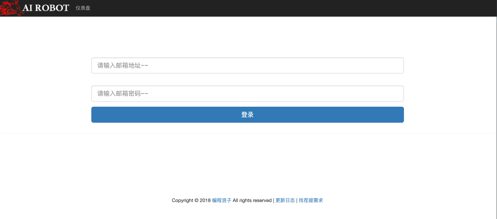
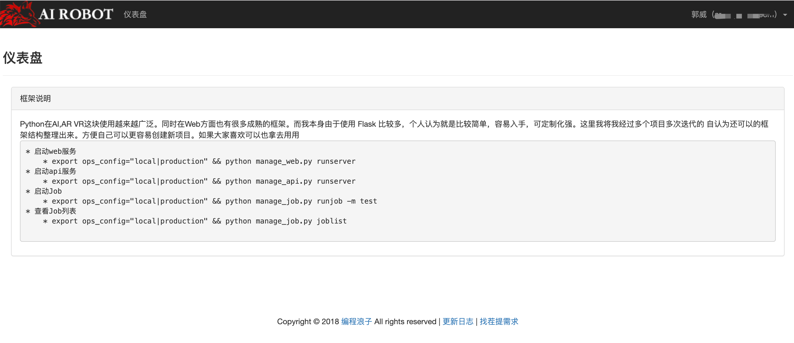
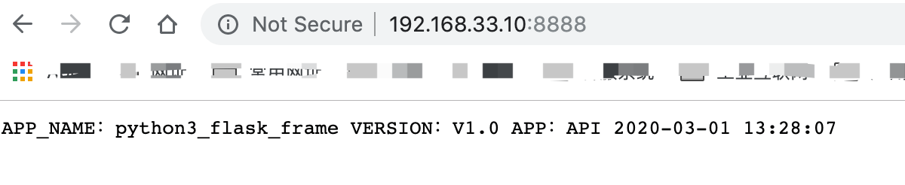
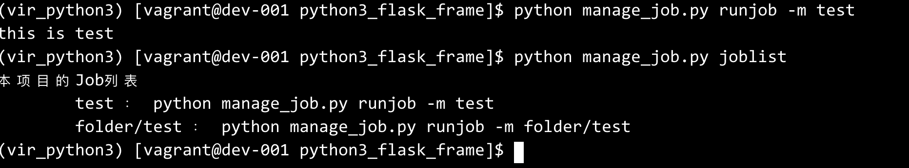

高可用高性能定制化 Python Flask MVC
==========================
## 缘由
```
Python在AI,AR VR这块使用越来越广泛。同时在Web方面也有很多成熟的框架。而我本身由于使用
Flask 比较多，个人认为就是比较简单，容易入手，可定制化强。这里我将我经过多个项目多次迭代的
自认为还可以的框架结构整理出来。方便自己可以更容易创建新项目。如果大家喜欢可以也拿去用用
```

## QuickStart
* Python3
* pip install -r requirements.txt

## 启动
* 启动web服务
    * export ops_config="local|production" && python manage_web.py runserver
* 启动api服务
    * export ops_config="local|production" && python manage_api.py runserver
* 启动Job
    * export ops_config="local|production" && python manage_job.py runjob -m test
* 查看Job列表
    * export ops_config="local|production" && python manage_job.py joblist

## 预览截图
#### Web
* 
* 
#### Api
* 
#### Job
* 

## 代码目录结构
```
.
├── application.py  封装的Flask的全局变量，包括app，数据库等
├── common 存放公用部分
│   ├── libs  公用方法或者类
│   ├── models 所有的数据库model
├── config 配置文件
│   ├── base_setting.py   基础配置
│   ├── develop_setting.py 开发环境
│   ├── local_setting_demo.py 本地开发环境配置demo
│   └── production_setting.py 生产环境的配置
├── docs 文档存放
│   ├── Mysql.MD  所有数据库变更必须在这里记录
├── jobs 定时任务
│   ├── bin
│   └── tasks 所有定时任务都存放在这里
├── router 路由配置入口
│   ├── www.py 对应web的路由配置
│   └── api.py 对应api的路由配置
├── manage_web.py web启动入口
├── manage_job.py job定时器启动入口
├── manage_api.py api启动入口 (如果有api的话)
├── requirements.txt python 扩展
├── uwsgi.ini 生产环境uwsgi
├── web  HTTP存放
│   ├── controllers 所有的C层放在这里
│   ├── interceptors 拦截器相关
│   ├── static 静态文件
│   └── templates 模板文件
```

## Flask参考文档
* http://www.pythondoc.com/flask/index.html
* https://flask-login.readthedocs.io/en/latest/#how-it-works
* [flask-debugtoolbar](http://www.pythondoc.com/flask-debugtoolbar/)
* [sqlacodegen](https://blog.csdn.net/fungleo/article/details/78865921)

    ```
    sqlacodegen 'mysql://root:@127.0.0.1/python3_flask_frame?charset=utf8mb4' --tables user > common/models/User.py
    ```

* [flask-sqlacodegen](https://github.com/ksindi/flask-sqlacodegen)
    ```
    flask-sqlacodegen 'mysql://root:@127.0.0.1/python3_flask_frame?charset=utf8mb4' --tables user --outfile "common/models/user.py"  --flask
    ```


## 问题处理
* 安装 MySQL-python ，结果出错 ImportError: No module named 'ConfigParser'

```
在 Python 3.x 版本后，ConfigParser.py 已经更名为 configparser.py 所以出错！
解决方法：pip install mysqlclient
```
